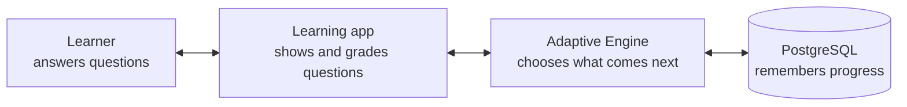
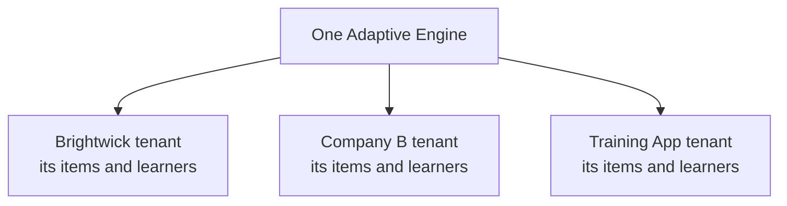
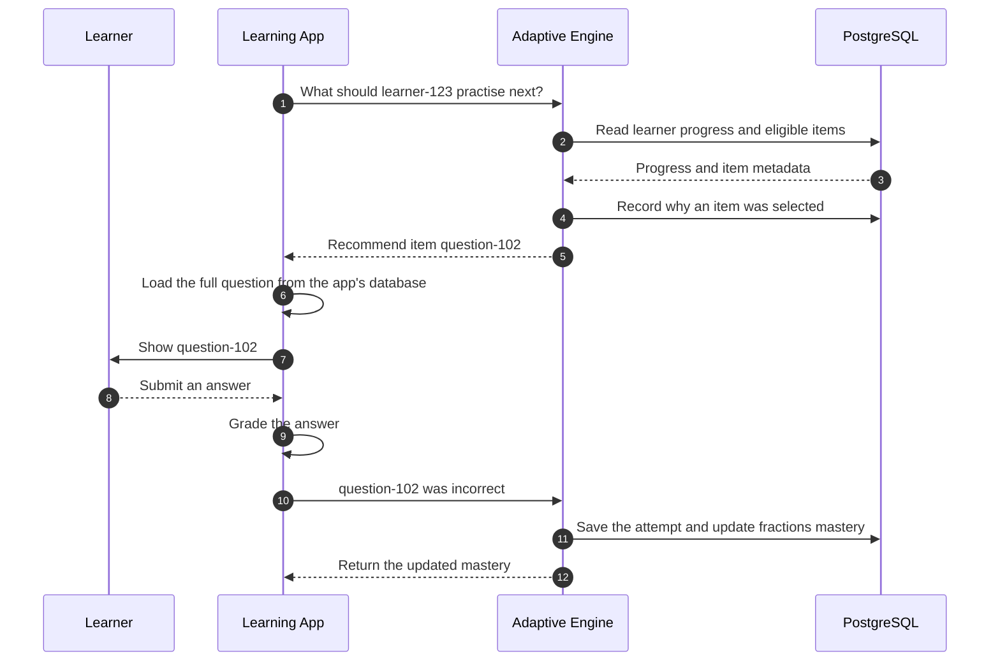
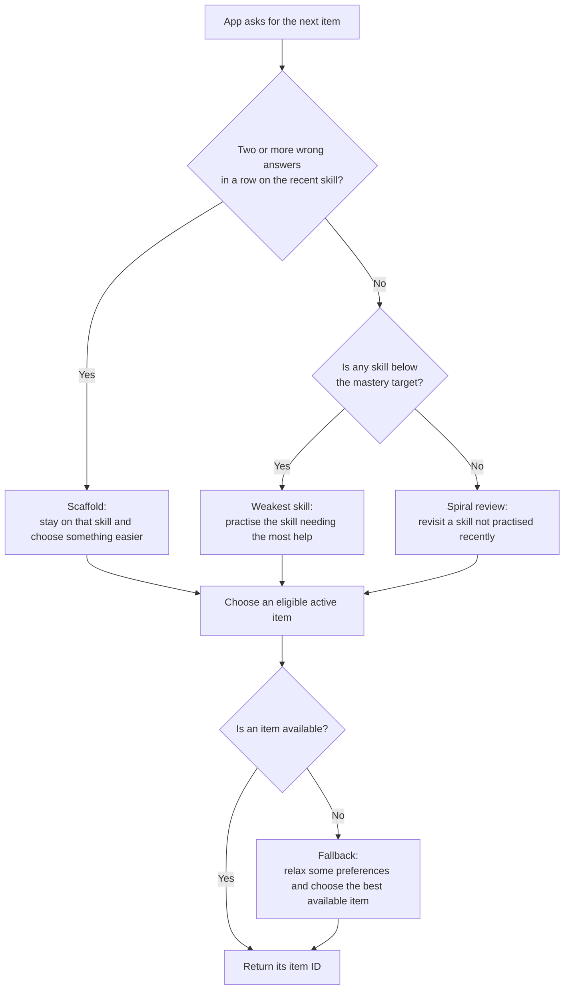
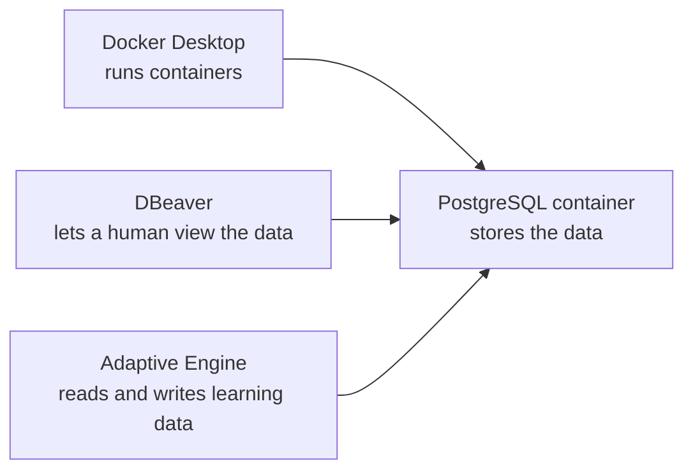

# The Adaptive Engine, Explained Simply

This guide assumes you know nothing about adaptive learning, APIs, Docker, or
databases.

## The entire idea in one sentence

The Adaptive Engine is a **small decision-making service that learns which
skills a learner is strong or weak at and recommends what they should practise
next**.

It is the brain that chooses the next exercise. It is **not** the screen where
the learner sees or answers the exercise.

## A simple story

Imagine a learner named Mia is using a maths app.

The maths app owns these questions:

- Question 101: easy fractions
- Question 102: medium fractions
- Question 103: hard fractions
- Question 201: easy multiplication

The Adaptive Engine does not store the words, pictures, choices, or correct
answers for those questions. It only knows small labels such as:

```text
Question 101 → fractions → difficulty 1
Question 102 → fractions → difficulty 3
Question 103 → fractions → difficulty 5
Question 201 → multiplication → difficulty 1
```

When Mia needs another question, the maths app asks the engine:

> Which question ID should Mia receive next?

The engine might answer:

```text
Question 102
```

The maths app finds Question 102 in its own database and shows it to Mia. Mia
answers it, and the maths app grades the answer. The app then tells the engine
only:

```text
Mia answered Question 102 incorrectly.
```

The engine lowers its estimate of Mia's fractions mastery. The next time the
app asks, the engine may recommend the easier Question 101.

That repeating process is the adaptive-learning loop.

## The four participants



### 1. The learner

The person practising, such as Mia.

### 2. The learning app

This could be Brightwick or another learning product. It:

- stores the questions and answers;
- displays questions to learners;
- decides whether an answer is correct; and
- talks to the Adaptive Engine from its backend server.

### 3. The Adaptive Engine

It:

- receives question metadata;
- receives correct/incorrect results;
- estimates mastery for each learner and skill; and
- recommends the ID of the next question.

### 4. PostgreSQL

This is the engine's memory. If the engine restarts, PostgreSQL still remembers
the tenants, question metadata, learner progress, answers, and recommendations.

## What the engine does not do

The engine does **not**:

- display a user interface to learners;
- store the full question text or images;
- store answer choices or answer keys;
- decide whether an answer is correct;
- replace the learning app; or
- store learner names or email addresses.

Think of it as a specialist adviser working behind the scenes.

## Why a tenant is needed

A **tenant** means one organization or application using the engine.

Imagine the engine is an apartment building:

- the entire building is the Adaptive Engine;
- each apartment is a tenant; and
- each apartment's belongings are that tenant's data.

Brightwick can be one tenant. Another education company could be another
tenant. They use the same engine, but their data stays separated.



Every important database record includes a `tenant_id`. That is how the engine
knows which tenant owns it.

## Why an API key is needed

An **API key** is a secret password used by a tenant's backend server.

When Brightwick asks the engine for something, it sends its API key. The engine
uses the key to answer three questions:

1. Who is calling?
2. Which tenant's data may they use?
3. What are they allowed to do?

The API key must stay on the backend server. It must never be placed in public
browser or mobile-app code.

The key is not Mia's password. Mia never needs to see it.

## What must happen before recommendations work

The engine cannot recommend from an empty question bank. Three things must be
prepared.

### Step 1: Create a tenant and API key

This gives the learning app its private space and secret key.

### Step 2: Send item metadata to the engine

An **item** means a question or exercise. The learning app sends only metadata,
for example:

```json
{
  "itemId": "question-102",
  "skill": "mathematics:fractions",
  "difficulty": 3,
  "gradeBand": "grade-4"
}
```

The actual question stays in the learning app.

### Step 3: Use the practise loop

The app asks for a recommendation, shows and grades the question, and reports
the result. It repeats this for every attempt.

## The complete practise loop



Notice that the learner talks to the learning app, not directly to the engine.

## How the engine represents learning

For each learner and skill, the engine keeps a **mastery score** between `0`
and `1`.

```text
0.0         0.5         1.0
weak      starting      strong
```

A new skill starts at `0.5` because the engine does not know the learner yet.

- A correct answer moves mastery upward.
- An incorrect answer moves mastery downward.
- The question's difficulty affects how large the movement is.
- More attempts give the engine more evidence about the learner.

Example only—the exact numbers depend on difficulty:

```text
Starting fractions mastery:        0.50
After a correct answer:            higher than 0.50
After a later incorrect answer:    lower than the previous score
```

Mastery is an estimate used for recommendations. It is not a school grade or a
percentage shown to the learner unless the learning app chooses to present it.

## How the next item is chosen

The engine follows a priority order.



In plain language:

1. If the learner is struggling repeatedly, give support and reduce difficulty.
2. Otherwise, work on the learner's weakest skill.
3. If all known skills are strong, revisit an older skill for review.
4. Avoid repeating very recent items when fresher choices exist.

## A concrete example

Suppose Mia has this progress:

| Skill | Mastery | Meaning |
| --- | ---: | --- |
| Fractions | 0.35 | Needs practice |
| Multiplication | 0.78 | Doing fairly well |
| Addition | 0.90 | Strong |

The engine will normally prioritize fractions because it is Mia's weakest
skill. If Mia gets two fractions questions wrong in a row, it stays on
fractions but looks for an easier question. Once her skills are strong, the
engine occasionally revisits something she has not practised recently.

## What the database tables mean

You can see these tables in DBeaver:

| Table | Simple meaning |
| --- | --- |
| `tenants` | The organizations or apps using the engine |
| `api_keys` | The tenants' protected access keys; only secure hashes are stored |
| `items` | Question IDs and learning labels, not full question content |
| `learner_skill_state` | The latest mastery estimate for each learner and skill |
| `answer_events` | A history of reported correct/incorrect attempts |
| `selection_events` | A history of what the engine recommended and why |
| `schema_migrations` | A checklist of database-structure updates already installed |

The first two migrations created these tables, but most will be empty until a
tenant is created and the learning app starts sending items and attempts.

## Docker, DBeaver, PostgreSQL, and the engine

These tools have different jobs:



- **Docker Desktop** runs the local PostgreSQL container.
- **PostgreSQL** is the actual database.
- **DBeaver** is only a visual tool for you to inspect the database.
- **Adaptive Engine** is the service containing the recommendation logic.

Closing DBeaver does not stop PostgreSQL. DBeaver is a window into the database,
not the database itself.

## Local development versus production

```text
Local development:
Adaptive Engine → PostgreSQL in Docker on your Mac

Production:
Adaptive Engine → managed PostgreSQL on Supabase
```

The application code is the same. The `DATABASE_URL` setting tells it which
database to use.

## Why answer attempts need an idempotency key

Sometimes a network request is retried. Without protection, the engine could
count one answer twice.

Every answer attempt therefore includes a unique `idempotencyKey`, normally the
learning app's unique attempt ID. If the exact request is retried, the engine
recognizes it and returns the original result instead of updating mastery
twice.

Think of it like a receipt number: the same receipt cannot be charged twice.

## What happens when something is unavailable

- No valid API key: the request is rejected.
- No items have been sent: the engine cannot recommend anything.
- No item matches the requested filters: the engine reports that no eligible
  item was found.
- The same answer request is retried: it is safely replayed without being
  counted twice.
- PostgreSQL is unavailable: the engine cannot remember or calculate the
  required state, so its readiness check fails.

## Words you will meet, in one line each

| Word | Plain meaning |
| --- | --- |
| Tenant | One organization or app with its own private space in the engine |
| API key | The secret password a tenant's backend uses to call the engine |
| Item | One question or exercise, known to the engine only by its labels |
| Metadata | The small labels about a question—never the question itself |
| Mastery | The engine's 0-to-1 estimate of how strong a learner is at a skill |
| Skill | One thing being learned, such as `mathematics:fractions` |
| Scaffold | Choosing an easier question after repeated wrong answers |
| Spiral review | Revisiting an older, strong skill so it is not forgotten |
| Idempotency key | A receipt number that stops one answer being counted twice |
| Migration | A recorded, repeatable update to the database's structure |

## Questions people often ask

**Does the engine know who Mia is?**
No. It only sees an opaque learner ID such as `learner-123`. Her name, email,
and account live in the learning app.

**Can the engine work for subjects other than maths?**
Yes. It never reads question content, so any subject works as long as items are
labelled with a skill and a difficulty.

**What happens on a learner's very first question?**
Every skill starts at a neutral mastery of 0.5, so the engine begins with a
middle-difficulty item and adjusts as evidence arrives.

**Can two companies see each other's data?**
No. Every record carries a `tenant_id`, and every request is limited to the
tenant that owns the API key.

**Why not just pick random questions?**
Random practice wastes time on skills the learner already knows and can
frustrate a struggling learner. The engine spends each attempt where it helps
most, and records the reason for every choice.

**What if the engine is down?**
The learning app still works—it simply falls back to its own default question
order until the engine is reachable again.

## The shortest possible summary

```text
1. Create a tenant and its secret API key.
2. Tell the engine which item IDs exist and what skills they teach.
3. Ask the engine for the next item ID for a learner.
4. The learning app displays and grades that item.
5. Tell the engine whether the answer was correct.
6. The engine updates mastery and makes a better next recommendation.
7. Repeat.
```

The learning app owns the learning experience and content. The Adaptive Engine
only supplies the memory and decision-making needed to personalize the next
step.
